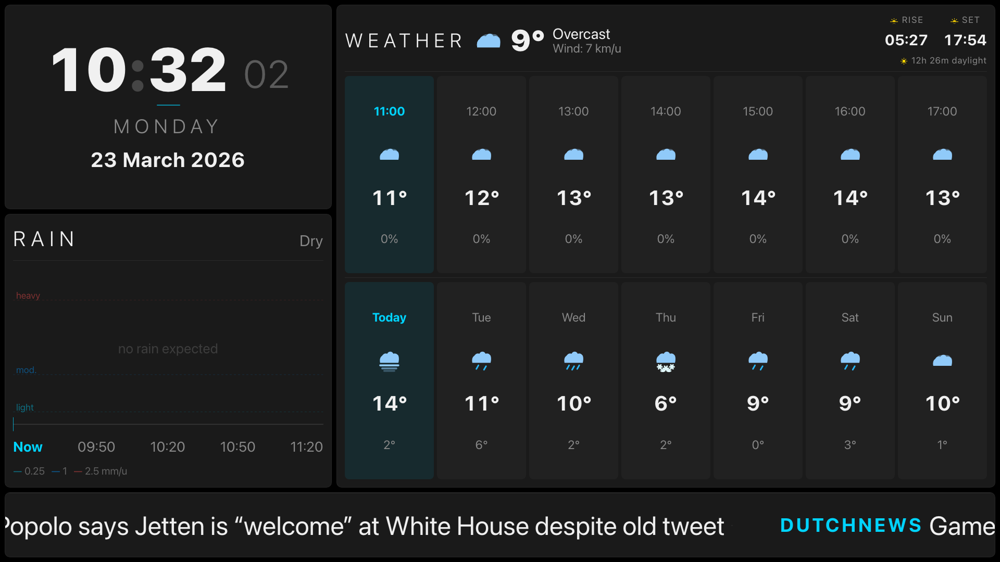
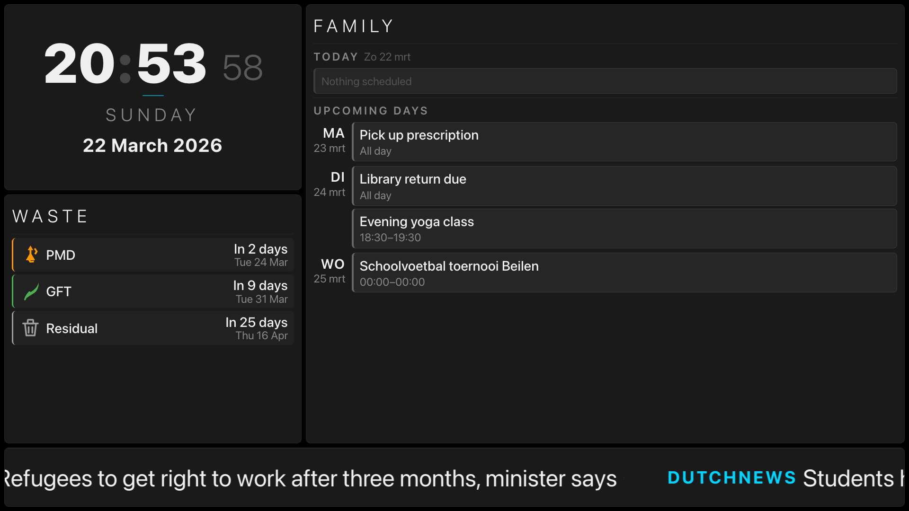
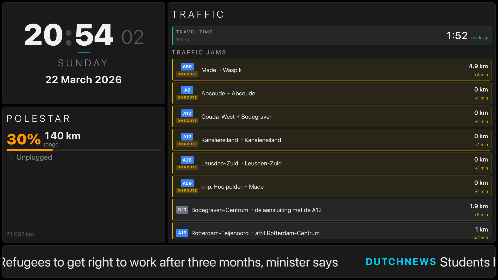
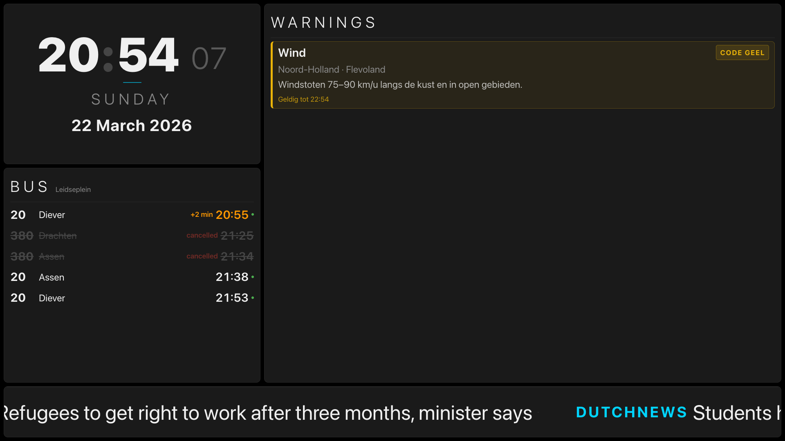
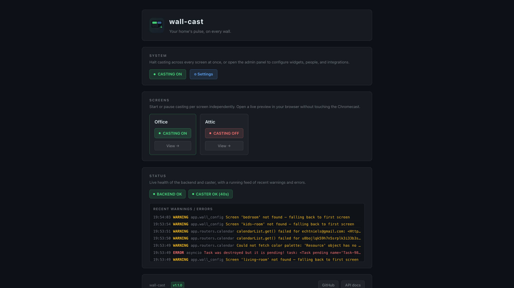
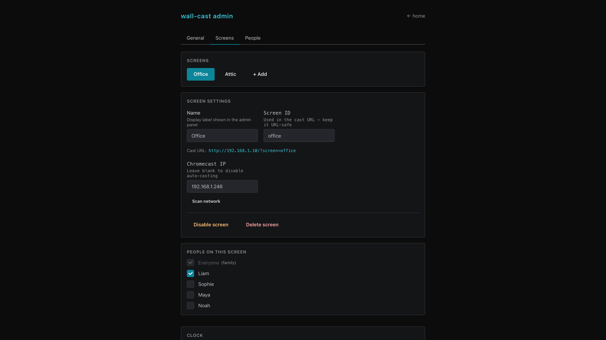

# wall-cast

**A self-hosted home display that casts personalised information to Android TV sets, Android TV boxes, and Chromecast-connected screens around your house.**

Put the weather, family calendar, bin collection schedule, and live travel times on the TV in the living room. Put a different mix — with the kids' school schedule, the rain radar, and bus / tram departures — on the screen in their room. All from one Docker stack, hot-reloading, no cloud, no subscription.

**This is not a digital signage system.** It's a lightweight, family-oriented display: *my* weather, *our* schedule, *the* waste collection. It runs entirely on a Docker host on your home LAN — a Raspberry Pi, a NAS, a spare PC — and casts the display to whichever Chromecasts or Google TVs you point it at.

It is fully AI-coded and designed to be extended. Fork it, [tell Claude what you want](docs/prompt-a-feature.md), and iterate from there.

---

## What it looks like

<!-- Screenshots: 2×2 grid of cast screens, then a row with landing page + admin panel -->

<p align="center">
  
  
</p>
<p align="center">
  
  
</p>
<p align="center">
  
  
</p>

## Features

- **Multi-screen** — one installation drives multiple Chromecasts, each with its own layout and content
- **Hot-reload config** — save the YAML, every screen updates within ~1 second; no container restart needed
- **Widget system** — mix and match widgets per screen; layout, spans, and config all in one YAML file
- **People & Calendars** — assign household members to screens; family members appear on all screens automatically
- **Admin panel** — browser-based UI at `/#admin`: configure screens, people, feeds, assistant, and Chromecast IPs; built-in LAN scanner to discover devices
- **Assistant** — proactive push notifications via ntfy: bin day reminders, bus delay alerts cross-correlated with your calendar, commute delay warnings, and weather alerts; optional AI (Ollama/OpenAI) rewrites messages into natural language
- **Network widget** — shows WAN status, external connectivity, LAN host count, and a Cloudflare speedtest; optionally integrates with a Zyxel VMG8825 router
- **Dark theme** — pure black background, bold white type, cyan accent
- **Dutch / English** — all widget labels switch with `language: en/nl`
- **Rotate widget** — cycle multiple widgets in one grid cell on a configurable interval
- **Mostly no API keys** — most data sources are free and unauthenticated
- **Modular** — add new widgets without touching core code; [step-by-step guide](docs/adding-a-widget.md) included

## Widgets

| Widget | Size | Data source | Refresh |
|--------|------|-------------|---------|
| **Clock** | L | Client-side | Every second |
| **Weather** | L | [open-meteo.com](https://open-meteo.com) — current, hourly, 7-day | 15 min |
| **Rain forecast** | S | [buienalarm.nl](https://buienalarm.nl) — rain chart for next 2 h | 5 min |
| **News ticker** | Full | RSS feeds (configurable list) | 10 min |
| **Sunrise/sunset** | — | [sunrise-sunset.org](https://sunrise-sunset.org/api) — embedded in weather widget | 6 h |
| **Garbage** | S | [mijnafvalwijzer.nl](https://mijnafvalwijzer.nl) — upcoming collection (NL) | 1 h |
| **Polestar** | S | [pypolestar](https://github.com/pypolestar/pypolestar) — SOC, range, charging, service | 5 min |
| **Calendar** | L | Google Calendar (service account) | 10 min |
| **Traffic** | L | ANWB (jams) + TomTom (travel time) | 5 min |
| **KNMI warnings** | L | [MeteoAlarm](https://meteoalarm.org) — active NL weather warnings; hidden when none | 15 min |
| **Bus / tram departures** | S | [vertrektijd.info](https://vertrektijd.info) — live departures, cancelled services shown | 30 s |
| **Network** | S | Router DAL API + Cloudflare speedtest — WAN status, connectivity, LAN hosts, speed | 30 s |
| **Rotate** | Any | Container — cycles child widgets in one grid cell | — |

*Size guide — **S**: designed for the small bottom slot (~4×4 cells); **L**: designed for the large main slot (~8×7 cells); **Full**: full-width single-row strip; **Any**: container, inherits size from its grid position.*

## Quick start

### 1. Clone

```bash
git clone https://github.com/niels-emmer/wall-cast
cd wall-cast
```

### 2. Create your `.env`

```bash
cp .env.example .env
```

Edit `.env` and set the required values:

**`UID` / `GID`** — file ownership for config files written by the backend. Run `id -u && id -g` on the host to get your values. Default `1000` is fine on most Linux installs.

**`SERVER_URL`** — the LAN address of this Docker host, as seen from the Chromecasts. Use `ip addr` (Linux) to find it. Must be an IP, not `localhost` — the TV resolves localhost as itself.

```
SERVER_URL=http://192.168.1.10
```

**`TIMEZONE`** — IANA timezone name, e.g. `Europe/Amsterdam`. [Full list](https://en.wikipedia.org/wiki/List_of_tz_database_time_zones).

The remaining settings are optional — only fill in the ones for widgets you plan to use:

**`GOOGLE_SA_KEY_FILE` / `GOOGLE_CALENDAR_ID`** *(calendar widget)* — requires a Google service account. Create one at [console.cloud.google.com](https://console.cloud.google.com) → APIs & Services → Credentials, enable the Calendar API, and download the JSON key to `config/google-sa.json`. Share your Google Calendar with the service account — find the service account email in **Admin → General → Calendar**. The Calendar ID is under Settings → your calendar → *Integrate calendar*.

**`TOMTOM_API_KEY`** *(traffic widget)* — free key from [developer.tomtom.com](https://developer.tomtom.com) (no credit card). Home/work address and route roads are set in the admin panel.

**`VERTREKTIJD_API_KEY`** *(bus / tram widget, Netherlands only)* — free account at [vertrektijd.info/starten.html](https://vertrektijd.info/starten.html). Stop city and name are set in the admin panel.

**`POLESTAR_USERNAME` / `POLESTAR_PASSWORD`** *(Polestar widget)* — the credentials you use to log in to the Polestar app or [my.polestar.com](https://my.polestar.com).

**`ROUTER_PASSWORD`** *(network widget, optional)* — password for the Zyxel VMG8825 router admin interface. Router URL and username are set in the admin panel (General → Network widget). Without this the widget still shows connectivity, DNS, and speedtest results.

### 3. Run

```bash
docker compose up -d --build
```

The config file (`config/wall-cast.yaml`) is created automatically on first run with sensible defaults.

### 4. Configure

The casting server is now available at **`http://<host-ip>`**. To set up and configure your server, click **Configure**. (Alternatively, go directly to **`http://<host-ip>/#admin`** for the admin panel.)

### 5. Enable casting

In the admin panel, go to **Screens** → select a screen → **Screen settings**. Click **Scan network** to discover Chromecast devices on your LAN, then click a device row to pre-fill the IP. Hit **Save**.

The display is cast to the TV within ~15 seconds of startup and re-casts automatically if the session drops.

To stop: `docker compose down`

## Updating

Pull the latest release and rebuild:

```bash
git pull
docker compose up --build -d
```

Check [Releases](https://github.com/niels-emmer/wall-cast/releases) for what changed.

## Configuration

All settings live in **`config/wall-cast.yaml`**. The file is gitignored and auto-created on first run — it will never block a `git pull`. Edit and save; the display reacts within ~1 second with no restart required.

See [`config/wall-cast.example.yaml`](config/wall-cast.example.yaml) for an annotated template with all options.

Full reference: [docs/config-reference.md](docs/config-reference.md)

### Via admin panel

Open the admin panel by clicking **Settings** on the home page, or by navigating to `/#admin`. It has four tabs:

- **General** — home location (lat/lon/name, with a Geolocate button), garbage collection address (postcode/house number, Netherlands), display language, news feed URLs, and network widget settings
- **Screens** — add/rename/delete/enable/disable screens; set Chromecast IP (use the **Scan network** button to discover devices); set screen ID, layout, clock options, rotator intervals; assign people to the screen; configure weather and calendar options per slot
- **People** — add household members; mark as family (appears on all screens automatically); add Google Calendar IDs; set commute addresses (home, work, route roads with autocomplete and auto-lookup) and bus / tram stop; add per-person RSS feeds; add per-person notification rules — used on any screen the person is assigned to
- **Assistant** — enable the notification assistant; configure ntfy server and topic; set AI provider (Ollama or OpenAI) and model; add, edit, and toggle notification rules using the condition builder (generic rules shared across everyone; per-person rules live in the People tab)

Changes are written back to `wall-cast.yaml` immediately and hot-reload onto the display.

### Via YAML

The config uses a `shared + screens[]` schema. Settings in `shared` apply to every screen; each screen can override or extend them.

```yaml
shared:
  location: { lat, lon, name }  # weather, rain, sunrise/sunset
  language: en                  # en or nl
  garbage: { postcode, huisnummer }
  people: [ ... ]               # household members with calendar IDs, commute, bus / tram stop
  widgets: [ ... ]              # widgets on every screen (e.g. news ticker)

screens:
  - id: living-room
    name: Living Room
    enabled: true               # set to false to stop casting without deleting the entry
    chromecast_ip: "192.168.1.42"
    people: [alice, bob]        # which people's calendars/commute/bus appear here
    layout: { columns: 12, rows: 8 }
    widgets: [ ... ]            # screen-specific widgets
```

See [`config/wall-cast.example.yaml`](config/wall-cast.example.yaml) for a full annotated template and [`docs/config-reference.md`](docs/config-reference.md) for the complete field reference.

Each screen is accessible at `/?screen=<id>`. The caster service opens this URL on the Chromecast automatically.

## People & Calendars

The **People** system lets you assign household members to screens so each screen shows the right calendars. Family members (marked as such) appear on every screen; everyone else only on the screens they're assigned to.

### Step 1 — Add people

Open `http://<host-ip>/#admin` → **People** tab → **+ Add person**.

For each person, enter their name, optionally tick **Family (all screens)**, and add their Google Calendar IDs. Then go to **Screens**, select a screen, and tick which people belong on it.

### Step 2 — Find the Google Calendar ID

| Calendar type | Where to find the ID |
|---|---|
| **Primary Gmail calendar** | Simply your Gmail address, e.g. `yourname@gmail.com` |
| **Shared / group calendar** | Google Calendar → Settings → click the calendar → *Integrate calendar* → copy the **Calendar ID** |

### Step 3 — Share the calendar with the service account

The backend reads calendars via a Google service account. It can only read calendars that have been explicitly shared with it.

1. Open [Google Calendar](https://calendar.google.com) → Settings → click the calendar
2. Scroll to **Share with specific people and groups** → **+ Add people**
3. Enter the **service account email** — find it in **Admin → General → Calendar** (it ends in `@...iam.gserviceaccount.com`)
4. Set permission to **See all event details** (read-only is sufficient)
5. Click **Send**

Repeat for every calendar you want to display.

> Changes take effect on the next calendar fetch (up to 10 minutes, or restart the backend to force an immediate refresh).

---

## Breaking news (ntfy)

If you run a [ntfy](https://ntfy.sh) instance, you can push messages directly onto the screen from anywhere — phone, script, or automation.

```bash
# Basic message
curl -d "Server is back online" https://ntfy.example.com/wall-cast

# With a headline title
curl -H "Title: Power outage" \
     -d "Grid restored at 14:32 after 47-minute outage" \
     https://ntfy.example.com/wall-cast
```

The message appears as a **`BREAKING`** item (red badge, amber title, blinking dot) interspersed in the news ticker every ~3 items. It stays visible until a new message arrives.

Configure in the news widget:
```yaml
ntfy_url: https://ntfy.example.com
ntfy_topic: wall-cast
```

The browser subscribes directly to the ntfy SSE endpoint — no backend proxy needed.

---

## Assistant

The assistant is a standalone sidecar service that watches your data and pushes proactive notifications to your phone or any ntfy-compatible client. It runs entirely on the Docker host and requires no cloud connection beyond your chosen notification channel.

### What it does

| Rule | Trigger | Smart cross-correlation |
|------|---------|------------------------|
| **Garbage** | Collection within 18 h (configurable) | — |
| **Calendar** | Event starting within 30 min (configurable) | — |
| **Bus** | Delay ≥ 5 min or cancellation | **Only fires if you have a calendar event in the next 90 min** — avoids spam on days you're not travelling |
| **Traffic** | Commute 25%+ above normal (configurable) | — |
| **Weather** | Orange or red KNMI warning | — |

Example notifications:

```
Garbage collection   GFT (organic waste) is being collected tomorrow (2026-03-23).
Bus delay            Line 2 (Centraal Station) at 08:45 is +8 min late.
                     You have 'Dentist' at 09:30.
Traffic delay        Niels: commute is 56 min today (16 min delay, +40% above normal).
Weather: Rood        Heavy rain warning for Noord-Holland. Until 2026-03-22 18:00.
```

### Setup

**1. Configure ntfy**

Install the [ntfy app](https://ntfy.sh) on your phone (Android / iOS) and subscribe to your chosen topic. If you self-host ntfy, point `ntfy_url` at your instance.

**2. Enable in admin panel**

Open `/#admin` → **Assistant** tab:

- Tick **Enable assistant**
- Enter your **ntfy server URL** and **topic**
- Review or edit the default rules (or add your own) using the condition builder
- Click **Save**

Or add directly to `wall-cast.yaml`:

```yaml
shared:
  assistant:
    enabled: true
    check_interval: 300          # seconds between check cycles

    notify:
      ntfy_url: https://ntfy.example.com
      ntfy_topic: wall-cast-alerts

    rules:
      - id: garbage-reminder
        title: Garbage pickup reminder
        enabled: true
        condition: { variable: garbage.hours_until_pickup, operator: "<=", value: 18, unit: h }
      - id: bus-delay
        title: Bus delay alert
        enabled: true
        condition: { variable: bus.delay_minutes, operator: ">=", value: 5, unit: min }
```

**3. Start the service**

```bash
docker compose up --build assistant -d
```

The assistant logs each notification it sends:

```
[assistant] ntfy → wall-cast-alerts: 'Garbage collection'
[assistant] ntfy → wall-cast-niels: 'Bus delay — Leidseplein'
```

### Per-person notification topics

Each person can have their own ntfy topic so alerts go to the right phone:

```yaml
shared:
  people:
    - id: niels
      name: Niels
      notify:
        ntfy_topic: wall-cast-niels   # overrides the global topic for Niels's alerts
```

### AI formatting (optional)

By default the assistant sends concise template messages. Enable an AI provider to rewrite them into natural language and combine related facts into a single sentence.

| Provider | Config |
|----------|--------|
| **None** (default) | Template strings — no extra setup |
| **Ollama** (self-hosted) | Set `provider: ollama`, `ollama_url`, and `ollama_model` (recommended: `llama3.2:3b`) |
| **OpenAI** | Set `provider: openai`, `OPENAI_API_KEY` in `.env`, optionally `openai_model` |

```yaml
    ai:
      provider: ollama
      ollama_url: http://host.docker.internal:11434
      ollama_model: llama3.2:3b
```

With AI enabled, the bus delay example above might be rewritten as:

> *"Heads up Niels — the line 2 at 08:45 is running 8 minutes late, and you've got your dentist appointment at 09:30."*

AI is **additive only**: rules still fire deterministically; if the AI call fails, the assistant falls back to the template message automatically.

### Deduplication

The assistant tracks sent notifications in `/config/assistant-state.json`. Each rule fires at most once per event — you won't get the same bin-day reminder every 5 minutes. State survives container restarts. Old entries are pruned automatically after 7 days.

---

## Architecture

```
┌─── Docker host ──────────────────────────────────────────────────────┐
│                                                                       │
│  ┌──────────────────┐  /api/*   ┌───────────────────────────────┐   │
│  │  frontend        │──────────▶│  backend  (FastAPI :8000)     │   │
│  │  nginx :80       │           │                               │   │
│  │  React SPA       │           │  GET /api/config?screen=      │   │
│  └──────────────────┘           │  GET /api/config/stream (SSE) │   │
│                                 │  PUT /api/admin/config        │   │
│                                 │  GET /api/admin/scan ────────▶│───┼──▶ scanner :8765
│                                 │  GET /api/weather, rain, …    │   │
│                                 └───────────────┬───────────────┘   │
│                                                 │ reads/writes       │
│                                        config/wall-cast.yaml         │
│                                                 │                    │
│  ┌──────────────────┐ host net  ┌───────────────┴───────────────┐   │
│  │  caster          │           │  scanner                      │   │
│  │  reads config    │           │  HTTP :8765                   │   │
│  │  catt cast_site  │           │  catt scan (mDNS)             │   │
│  │  → each screen   │           └───────────────────────────────┘   │
│  └────────┬─────────┘                                                │
│                                                                       │
│  ┌──────────────────────────────────────────────────────────────┐   │
│  │  assistant                                                   │   │
│  │  polls GET /api/garbage, /api/calendar, /api/bus, …         │   │
│  │  runs rules → deduplicates → pushes ntfy notifications  ────┼───┼──▶ ntfy / phone
│  └──────────────────────────────────────────────────────────────┘   │
└───────────┼──────────────────────────────────────────────────────────┘
            │ DashCast receiver
            ▼
   Chromecast / Google TV  (same LAN)
   loads /?screen=<id>  ←  SSE keeps page live
   browser subscribes to ntfy SSE directly (no proxy)
```

**Five Docker services:**

- **frontend** — nginx:alpine on port 80; serves the Vite-built React SPA; proxies `/api/*` to the backend with `proxy_buffering off` for SSE
- **backend** — python:3.12-slim (internal, not exposed on the host); FastAPI; reads/writes `config/wall-cast.yaml`; proxies all external API calls with caching
- **caster** — python:3.12-slim with `network_mode: host` (required to reach Chromecasts on the LAN); reads `chromecast_ip` from each screen in the config; uses `catt cast_site` with the DashCast receiver; polls every 60 s and re-casts if the session drops
- **scanner** — python:3.12-slim with `network_mode: host` on port 8765; runs `catt scan` on demand via mDNS; backend proxies `GET /api/admin/scan` to it via `host.docker.internal`
- **assistant** — python:3.12-slim; polls the backend `/api/*` endpoints every 5 min; runs configurable rules; pushes notifications via ntfy; state persisted in `/config/assistant-state.json`; fully opt-in via `shared.assistant.enabled`

---

## Development

For fast iteration without rebuilding Docker images:

```bash
docker compose -f docker-compose.dev.yml up --build
```

- **Frontend** (Vite HMR): http://localhost:5173
- **Backend** (FastAPI + live reload): http://localhost:8000
- **API docs** (Swagger): http://localhost:8000/api/docs

Or run the frontend standalone (fastest):

```bash
cd frontend && npm install && npm run dev
```

(Requires the backend running on port 8000.)

## Extending the project

This project is fully AI-coded and designed to be extended by prompting. See [docs/prompt-a-feature.md](docs/prompt-a-feature.md) for a framework — a prompt structure that lets you describe a feature in plain language and have Claude implement it end-to-end: branch, config, admin UI, widget code, tests, docs, commit, and PR.

### Adding widgets

See [docs/adding-a-widget.md](docs/adding-a-widget.md) for a step-by-step guide and [docs/widget-style-guide.md](docs/widget-style-guide.md) for the design token system used across all widgets.

The widget registry is in `frontend/src/widgets/index.ts`. Any component registered there is immediately available in the YAML config.

## Security

- **nginx is the only public port** (80) — the backend is never exposed on the host
- All external API calls are **proxied server-side** — no CORS leakage, responses cached
- `server_tokens off` and security headers (`X-Content-Type-Options`, `X-Frame-Options`, `Referrer-Policy`) set in nginx
- **No authentication by design** — intended for local networks only
- Backend runs as your host UID/GID (set in `.env`) so config files are always owned by the right user

If your host is internet-facing, add `allow`/`deny` rules in `nginx.conf`:

```nginx
location / {
    allow 192.168.0.0/16;
    allow 10.0.0.0/8;
    deny all;
}
```

## Project layout

```
wall-cast/
├── config/
│   ├── wall-cast.yaml          ← gitignored; auto-created on first run
│   └── wall-cast.example.yaml  ← annotated template (tracked in git)
├── backend/
│   ├── app/
│   │   ├── main.py             FastAPI app + lifespan
│   │   ├── wall_config.py      YAML loader + auto-create/migrate + SSE broadcaster
│   │   └── routers/            one file per API endpoint (weather, rain, news, sun,
│   │                           garbage, polestar, calendar, traffic, warnings, bus,
│   │                           network, config, status)
│   └── requirements.txt
├── frontend/
│   └── src/
│       ├── App.tsx             CSS grid layout + admin routing
│       ├── admin/              admin panel UI (/#admin)
│       ├── i18n/               translations (nl/en) + useLang() hook
│       ├── widgets/            one directory per widget type
│       │   ├── index.ts        ← widget registry
│       │   └── styles.ts       ← design token system (font sizes, spacing, colour)
│       └── hooks/              one hook per data source
├── caster/
│   ├── cast.py                 smart multi-screen caster + keepalive loop
│   └── scanner.py              HTTP :8765; mDNS-based Chromecast discovery
├── assistant/
│   ├── assistant.py            main polling loop; reads config, runs rules, dispatches
│   ├── rules/                  engine.py dispatches rules by variable; one file per
│   │                           data domain extracts variable values (garbage, bus, …)
│   ├── notify/ntfy.py          push to ntfy via HTTP POST
│   ├── ai/formatter.py         optional AI message rewriting (Ollama / OpenAI)
│   └── state.py                deduplication state (JSON, persisted to /config)
├── docs/
│   ├── config-reference.md
│   ├── adding-a-widget.md
│   └── widget-style-guide.md
├── docker-compose.yml          production
└── docker-compose.dev.yml      development
```

---

## Credits

### Built with AI

This project was conceived, architected, and coded in collaboration with [Claude](https://claude.ai) (Anthropic) using [Claude Code](https://claude.ai/claude-code). Architecture, widget implementation, backend routing, CSS layout, debugging, and documentation — all prompted into existence.

### Data sources

| Source | Used for |
|--------|----------|
| [open-meteo.com](https://open-meteo.com) | Weather forecasts — free, no API key |
| [buienalarm.nl](https://buienalarm.nl) | Rain intensity forecast (2 h) |
| [sunrise-sunset.org](https://sunrise-sunset.org/api) | Sunrise, sunset, and daylight duration |
| [mijnafvalwijzer.nl](https://mijnafvalwijzer.nl) | Waste collection schedule (NL) |
| [vertrektijd.info](https://vertrektijd.info) | Real-time bus / tram departures (NL) |
| [ANWB](https://anwb.nl) | Traffic incidents |
| [TomTom Routing API](https://developer.tomtom.com) | Travel time |
| [MeteoAlarm](https://meteoalarm.org) | KNMI weather warnings |
| [pypolestar](https://github.com/pypolestar/pypolestar) | Polestar vehicle data |
| [ntfy.sh](https://ntfy.sh) | Self-hosted push notifications (breaking news) |

### Libraries and tools

**Backend**

| Library | Role |
|---------|------|
| [FastAPI](https://fastapi.tiangolo.com) | Web framework + SSE |
| [pydantic-settings](https://docs.pydantic.dev/latest/concepts/pydantic_settings/) | Settings management |
| [pyyaml](https://pyyaml.org) | YAML config loading |
| [watchfiles](https://watchfiles.helpmanual.io) | Config file watcher |
| [httpx](https://www.python-httpx.org) | Async HTTP client |
| [feedparser](https://feedparser.readthedocs.io) | RSS feed parsing |
| [catt](https://github.com/skorokithakis/catt) | Cast any URL to Chromecast via DashCast |

**Frontend**

| Library | Role |
|---------|------|
| [React](https://react.dev) | UI framework |
| [Vite](https://vitejs.dev) | Build tool + dev server |
| [TypeScript](https://www.typescriptlang.org) | Type safety |
| [TanStack Query](https://tanstack.com/query) | Data fetching and caching |
| [Mantine](https://mantine.dev) | Admin panel UI components |
| [Tailwind CSS](https://tailwindcss.com) | Utility CSS (non-layout) |

**Infrastructure**

| Tool | Role |
|------|------|
| [nginx:alpine](https://nginx.org) | Static file serving + API proxy |
| [Docker Compose](https://docs.docker.com/compose/) | Multi-service orchestration |

---

## License

MIT
